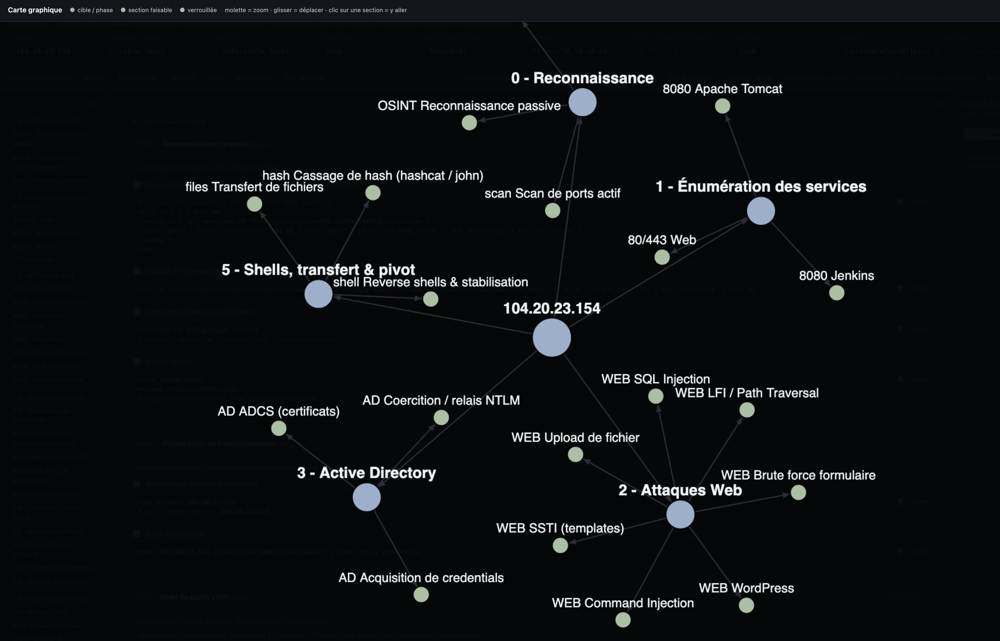

# Enum2Root

Une **carte de méthodologie de pentest** interactive, hors-ligne, en un seul fichier HTML. Saisissez votre cible une fois et chaque commande se met à jour ; indiquez à l'outil ce que vous possédez déjà (rien / un utilisateur / des identifiants / un hash / admin local / privilèges de domaine) et il met en évidence exactement les actions que vous pouvez lancer. Inspiré des [OCD mindmaps](https://orange-cyberdefense.github.io/ocd-mindmaps/) et de [WADComs](https://wadcoms.github.io/).

*A single-file, offline, interactive pentest methodology map (English section below).*

**▶ Démo en ligne / Live demo :** [Français](https://cchopin.github.io/Enum2Root/index.fr.html) · [English](https://cchopin.github.io/Enum2Root/)
**📖 Documentation :** site MkDocs dans [`docs/`](docs/) (build local : `pip install -r docs/requirements.txt && mkdocs serve`, prêt pour Read the Docs via `.readthedocs.yaml`).
**⬇ Télécharger / Download :** [index.fr.html (FR)](https://github.com/cchopin/Enum2Root/releases/latest/download/index.fr.html) · [index.html (EN)](https://github.com/cchopin/Enum2Root/releases/latest/download/index.html) · [toutes les releases](https://github.com/cchopin/Enum2Root/releases)

> ⚠️ Pour des tests autorisés, CTF et labs uniquement. N'utilisez ces commandes que contre des systèmes que vous avez explicitement le droit de tester.
> For authorized engagements, CTFs and labs only.

**[Français](#français) · [English](#english)**




Aucune installation, aucun build : un seul fichier HTML sans dépendance, ouvrez-le dans un navigateur.

- `index.fr.html` - version française (originale)
- `index.html` - English version

---

## Français

### Démarrage rapide

1. Ouvrez `index.fr.html` dans un navigateur récent (double-clic).
2. Renseignez les champs de la cible en haut (au minimum l'**IP**).
3. Cochez ce que vous possédez dans la barre **« Ce que je possède »**.
4. Déroulez la méthodologie ; copiez les commandes avec le bouton **copier** (votre cible est déjà substituée).

Flux typique avec un scan :

```bash
mkdir -p scans && sudo nmap -p- -sV -sC -T4 -oA scans/10.10.10.10 10.10.10.10
```

Puis cliquez sur **Charger .nmap**, choisissez `scans/10.10.10.10.nmap`, et la page (ainsi que le graphe) se réduisent aux seuls services réellement ouverts.

### Fonctionnalités

**Champs de cible dynamiques.** Les champs du header - IP, Domaine/FQDN, DC, Utilisateur, Mot de passe/hash, **Votre IP (LHOST/listener)**, Interface, Wordlist, URL web - sont substitués en direct dans toutes les commandes (affichés en jetons surlignés). Modifiez un champ et tout se met à jour instantanément.

**Système de prérequis (« Ce que je possède »).** Chaque action déclare ce dont elle a besoin : rien, un nom d'utilisateur, des identifiants valides, un hash NT, un admin local, un shell, ou des privilèges de domaine élevés. Cochez ce que vous détenez et les badges de prérequis passent en vert (acquis) ou rouge (manquant). C'est la logique des vraies missions, où les options dépendent du niveau d'accès.

**Actions indisponibles - Tout afficher / Réduire / Masquer.** Décide quoi faire des actions non encore réalisables : visibles mais grisées, **réduites** à une ligne de titre (par défaut), ou masquées.

**Mode Focus.** Un clic filtre toute la page selon votre contexte : les commandes faisables sont surlignées, celles dont les prérequis manquent se replient à leur titre, et les sections entièrement verrouillées disparaissent. Fonctionne au niveau de la commande, pas seulement de la section.

**Import nmap.** Chargez un scan `.nmap`, `.gnmap` ou `.xml` : la page ne garde que les sections des ports ouverts (closed/filtered ignorés), récupère l'IP/le host de la cible, et le graphe se filtre aussi. Générez le fichier avec `nmap -oA <base> <ip>` (ou `-oN`). Les sections « techniques » (recon, web, Active Directory, post-exploitation) restent toujours visibles car non liées à un port précis.

**Navigation repliable.** Chaque colonne a son propre chevron pour replier/déplier. Les phases se replient individuellement (menu et centre). Quand le filtrage masque des entrées du menu, un lien **« + N masquées »** par phase permet de les révéler à la demande.

**Recherche.** Filtre en direct sur les outils, ports et techniques ; déplie automatiquement ce qui correspond.

**Carnet de bord par commande.** Cliquez le crayon d'une commande pour coller et enregistrer sa sortie. Les entrées sont horodatées et conservées en historique (pas d'écrasement), cloisonnées **par cible** (l'IP), et persistées dans le `localStorage` du navigateur. Un badge vert indique les commandes documentées.

**Vues du carnet - Commandes / Timeline / Findings.** Le panneau de droite liste les commandes documentées, une timeline chronologique de toutes vos entrées, ou seulement celles marquées. Marquez une entrée comme **finding** avec l'étoile ★.

**Suivi par statut & progression.** Chaque étape a un statut à plusieurs états : cliquez sa case pour parcourir **·** à faire → **✓ validé** (réussi) → **✗ non valide** (échec) → **∅ non concerné** (sans objet pour cette box). Les états sont distincts visuellement : bordure verte pour *validé*, rouge pour *non valide*, ligne grisée et barrée pour *non concerné*. La progression compte les *validé* sur le total **hors « non concerné »** (le pourcentage reste pertinent), avec compteurs par section, par cible. L'ancien format de checklist (case unique) est migré automatiquement vers *validé*.

**RAZ (changer de box).** Le bouton **RAZ** vide les champs de la cible (IP, domaine, DC, utilisateur, mot de passe, URL) ainsi que le contexte « Ce que je possède » et le filtre nmap, pour repartir proprement sur une nouvelle box. Les champs côté attaquant (LHOST, interface, wordlist) et **toutes les notes/progression** sont conservés : ces dernières étant cloisonnées par IP, l'ancienne box reste accessible en ressaisissant son IP.

**Rapports & sauvegarde.** **Rapport .md** exporte un rapport Markdown de la cible courante avec une section `## Findings` en tête. **Export/Import JSON** sauvegarde et restaure tout le carnet (notes + findings + progression) entre machines.

**Liens de référence.** Chaque section pertinente a un bouton **HackTricks ↗** ; les sections d'attaques web (SQLi, XSS, LFI, command injection, SSTI, upload…) ont en plus un bouton **Payloads ↗** vers la page correspondante de PayloadsAllTheThings.

**Vue graphique.** Un bouton ouvre un graphe force-directed façon Obsidian (popup dans la page, sans Obsidian) : cible → phases → sections, coloré selon la disponibilité. Molette pour zoomer, glisser pour déplacer, clic sur une section pour y aller. Un bouton le limite aux sections faisables ; il respecte aussi le filtre nmap.

**Thème clair/sombre.** Bascule mémorisée entre les sessions. Les blocs de commande restent sombres pour la lisibilité « terminal ».

### Couverture méthodologique

- **0 - Reconnaissance :** OSINT passif, préparation, scan nmap actif.
- **1 - Énumération des services :** FTP, SSH, SMTP, DNS, Web, Kerberos, MSRPC, SMB/NetBIOS, SNMP, LDAP, MSSQL, MySQL, NFS, RDP, WinRM, Redis, PostgreSQL, Oracle, rsync, Tomcat, Jenkins, Docker, AJP/Ghostcat, MongoDB, VNC, IPMI.
- **2 - Attaques web :** SQLi, XSS, LFI/traversal, brute force de formulaire, WordPress, command injection, SSTI, upload.
- **3 - Active Directory :** acquisition de creds, énumération, Kerberoast/AS-REP, abus d'ACL/délégations, ADCS, coercition/relais NTLM, mouvement latéral, tickets & délégations, Shadow Credentials, domination du domaine.
- **4 - Post-exploitation :** privesc Linux & Windows, pillage & persistance.
- **5 - Shells, transfert & pivot :** reverse shells & stabilisation TTY, transfert de fichiers, tunneling (ligolo-ng, chisel, SSH), référence de cassage de hash.

### Vie privée

Tout s'exécute localement dans le navigateur. Notes, progression et réglages vivent uniquement dans le `localStorage` - rien n'est envoyé nulle part. Le seul trafic sortant survient si **vous** cliquez sur un lien de référence externe.

---

## English

### Quick start

1. Open `index.html` in any modern browser (double-click it).
2. Fill in the target fields at the top (at minimum the **IP**).
3. Tick what you currently possess in the **"What I have"** bar.
4. Work down the methodology; copy commands with the **copy** button (your target is already substituted in).

Typical workflow with a scan:

```bash
mkdir -p scans && sudo nmap -p- -sV -sC -T4 -oA scans/10.10.10.10 10.10.10.10
```

Then click **Load .nmap**, pick `scans/10.10.10.10.nmap`, and the page (and the graph) collapse down to only the services that are actually open.

### Features

**Dynamic target fields.** The header fields - IP, Domain/FQDN, DC, Username, Password/hash, **Your IP (LHOST/listener)**, Interface, Wordlist, Web URL - are substituted live into every command (shown as highlighted tokens). Change a field and all commands update instantly.

**Prerequisite system ("What I have").** Each action declares what it needs: nothing, a username, valid credentials, an NT hash, local admin, a shell, or elevated domain privileges. Tick the chips for what you currently hold and each action's requirement badges turn green (met) or red (missing). This mirrors how real engagements branch on your level of access.

**Unavailable actions - Show all / Reduce / Hide.** Decides what to do with actions you can't run yet: keep them visible but dimmed, **reduce** them to a single title line (default), or hide them entirely.

**Focus mode.** One click filters the whole page to your context: runnable commands get a colored highlight, the ones you lack prerequisites for collapse to their title, and fully-locked sections fold away. Works at the command level, not just the section level.

**Nmap import.** Load a `.nmap`, `.gnmap` or `.xml` scan and the page keeps only the sections for open ports (closed/filtered ignored), pulls the target IP/host from the scan, and the graph filters too. Generate the file with `nmap -oA <base> <ip>` (or `-oN`). Generic technique sections (recon, web attacks, Active Directory, post-exploitation) are always kept since they aren't tied to a single scanned port.

**Collapsible navigation.** Each column has its own chevron to fold/unfold. Phases collapse individually (left menu and center). When filtering hides menu entries, a per-phase **"+ N hidden"** link lets you reveal them on demand.

**Search.** Live filter across tools, ports and techniques; it auto-expands whatever it matches.

**Per-command notebook.** Click the pencil on any command to paste and save its output. Entries are timestamped and kept as history (not overwritten), scoped **per target** (the IP), and persisted in your browser's `localStorage`. A green badge shows which commands have notes.

**Notebook views - Commands / Timeline / Findings.** The right panel lists documented commands, a chronological timeline of all your entries, or just the ones you flagged. Mark any entry as a **finding** with the ★ star.

**Status tracking & progress.** Every step has a multi-state status: click its box to cycle **·** to do → **✓ valid** (success) → **✗ not valid** (failed) → **∅ not applicable** (irrelevant for this box). The states are visually distinct: green border for *valid*, red for *not valid*, dimmed strike-through for *not applicable*. Progress counts *valid* steps over the total **excluding "not applicable"** (so the percentage stays meaningful), with per-section counters, per target. The old single-checkbox format is migrated automatically to *valid*.

**RAZ (switch box).** The **RAZ** button clears the target fields (IP, domain, DC, user, password, URL) plus the "What I have" context and the nmap filter, so you can start cleanly on a new box. Attacker-side fields (LHOST, interface, wordlist) and **all notes/progress** are kept: since the latter are scoped per IP, the previous box stays reachable just by typing its IP again.

**Reports & backup.** **Report .md** exports a Markdown report for the current target with a `## Findings` section at the top. **Export/Import JSON** backs up and restores the whole notebook (notes + findings + progress) across machines.

**Reference links.** Every relevant section has a **HackTricks ↗** button; web-attack sections (SQLi, XSS, LFI, command injection, SSTI, upload…) also get a **Payloads ↗** button to the matching PayloadsAllTheThings page.

**Graph view.** A button opens an Obsidian-style force-directed graph (in-page popup, no Obsidian needed): target → phases → sections, colored by availability. Zoom with the wheel, drag to pan, click a section to jump to it. A toggle limits it to runnable sections; it also respects the nmap port filter.

**Light/Dark theme.** Toggle, remembered between sessions. Command blocks stay dark for terminal readability.

### Methodology coverage

- **0 - Reconnaissance:** passive OSINT, environment prep, active nmap scanning.
- **1 - Service enumeration:** FTP, SSH, SMTP, DNS, Web, Kerberos, MSRPC, SMB/NetBIOS, SNMP, LDAP, MSSQL, MySQL, NFS, RDP, WinRM, Redis, PostgreSQL, Oracle, rsync, Tomcat, Jenkins, Docker, AJP/Ghostcat, MongoDB, VNC, IPMI.
- **2 - Web attacks:** SQLi, XSS, LFI/path traversal, form brute force, WordPress, command injection, SSTI, file upload.
- **3 - Active Directory:** credential acquisition, domain enumeration, Kerberoast/AS-REP, ACL/delegation abuse, ADCS, coercion/NTLM relay, lateral movement, tickets & delegation, Shadow Credentials, domain dominance.
- **4 - Post-exploitation:** Linux & Windows privesc, looting & persistence.
- **5 - Shells, transfer & pivot:** reverse shells & TTY stabilization, file transfer, tunneling (ligolo-ng, chisel, SSH), hash cracking reference.

### Privacy

Everything runs locally in your browser. Notes, progress and settings live only in your browser's `localStorage` - nothing is sent anywhere. The only outbound traffic happens if **you** click an external reference link.

---

*Built with the help of Claude Code.*
