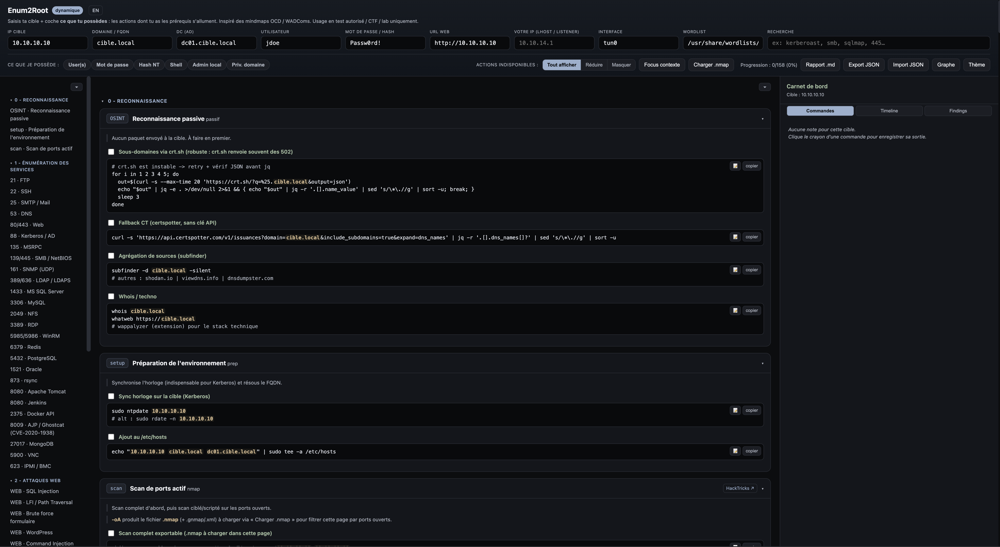

# Enum2Root

An interactive, offline **pentest methodology map** in a single HTML file. Enter your target
once, tell the tool what you already have, and it highlights exactly the actions you can run -
with, here, a **complete reference** linking every action to verified external resources.

[:material-rocket-launch: Live demo](https://cchopin.github.io/Enum2Root/){ .md-button .md-button--primary }
[:material-book-open-variant: Full reference](reference/index.md){ .md-button }
[:material-github: Source code](https://github.com/cchopin/Enum2Root){ .md-button }

!!! warning "Authorized use only"
    For authorized engagements, CTFs and labs only. Only run these commands against systems you
    are explicitly allowed to test.

## Where to start

-   :material-flag-checkered: __Quick start__

    Open the app, enter the target, import an nmap scan.

    [:octicons-arrow-right-24: Open](demarrage.md)

-   :material-feature-search: __Features__

    Contextual prerequisites, focus, notebook, graph, statuses, RAZ.

    [:octicons-arrow-right-24: Open](fonctionnalites.md)

-   :material-checkbox-multiple-marked: __Status & RAZ__

    Four-state status per step and a button to switch box.

    [:octicons-arrow-right-24: Open](statuts-et-raz.md)

-   :material-sitemap: __Reference by phase__

    Every action documented + verified external links.

    [:octicons-arrow-right-24: Open the reference](reference/index.md)

-   :material-tools: __Tools__

    Every tool used in the app, with its official link.

    [:octicons-arrow-right-24: Open](outils.md)

## Useful links

- **Demo:** [Français](https://cchopin.github.io/Enum2Root/index.fr.html) · [English](https://cchopin.github.io/Enum2Root/)
- **Download:** [latest release](https://github.com/cchopin/Enum2Root/releases/latest)
- **Code:** [github.com/cchopin/Enum2Root](https://github.com/cchopin/Enum2Root)

No install, no build for the tool itself: a single dependency-free HTML file
(`index.html` in English, `index.fr.html` in French) - open it in a browser.
